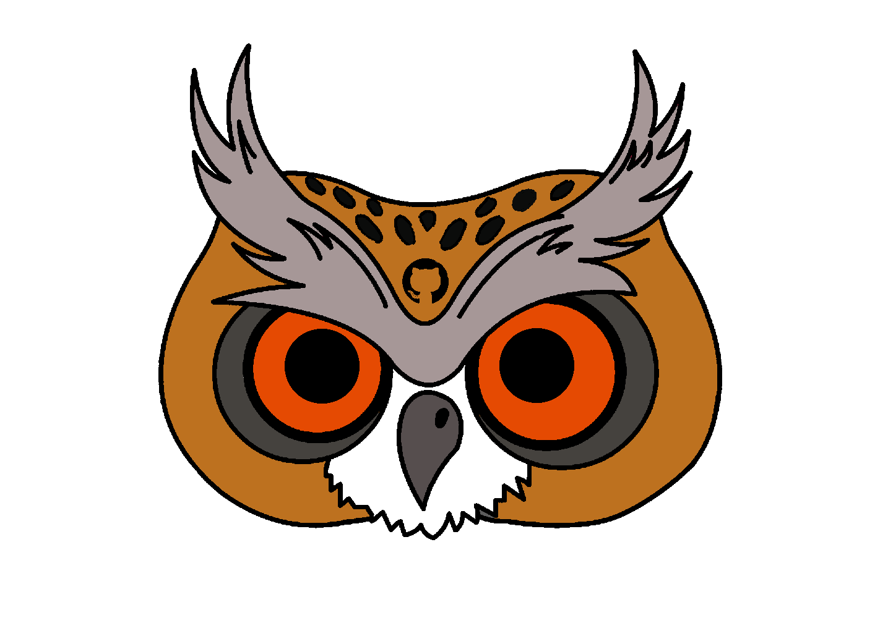

## Sobre o projeto

DashOwl é um dashboard ágil criado com o intuito de acompanhar em tempo real os repositórios do GitHub tirando métricas e indicadores das atividades feitas individualmente e pelo time. O projeto é uma extensão do GitHub para o navegador Google Chrome e permite aos usuários que utilizam a plataforma ao entrar em certo repositório tenham a opção de ver graficamente de acordo com a metodologia ágil um breve histórico das atividades feitas e/ou em andamento no projeto.

---

## Como posso usar o produto?

---

## Nosso time

Grupo de Métodos de Desenvolvimento de Software (MDS) 2019 - 2.

**Nome** | **Email** | **GitHub** 
---------|:---------:|:----------:
Ailamar Alves | ailamar.alvesg@gmail.com | ailamaralves
Damarcones dos Santos | damarcones@gmail.com | Damarcones
João Victor de Oliveira| joao15victor08@gmail.com | joao15victor08
Kalebe Lopes    | calbkalebe@gmail.com | KalebeLopes
Matheus Amaral  | mam.macacod@gmail.com | Matheus-AM
Murilo Schiler  | muriloschiler.ls@gmail.com | muriloschiler

