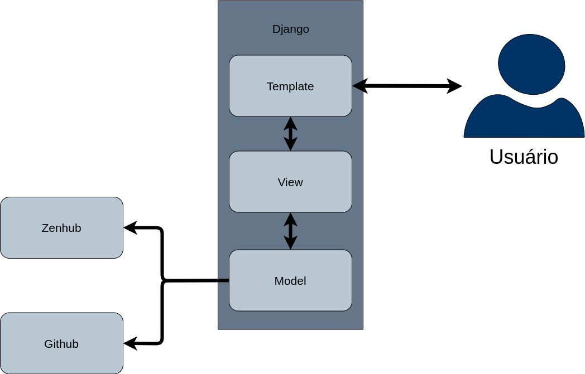

# Arquitetura

## Histórico de revisão

Data | Versão | Descrição | Autor
----: | :------: | --------- | -----
26/09/19 | 1.0 | Iniciando documento, formatação | Ailamar Alves, Matheus Amaral
26/09/19 | 1.1 | Adição dos tópicos de 1 à 1.5 | Ailamar Alves, Matheus Amaral
29/09/19 | 1.2 | Adição dos tópicos 2 e 3.1 | João Victor

## Índice

1. Introdução  
  1.1 Finalidade  
  1.2 Escopo  
  1.3 Definições, Acrônimos e Abreviações  
  1.4 Referências  
  1.5 Visão Geral  
2. Representação Arquitetural 
  2.1 Diagrama de Relações 
  2.2 Representação dos Microsserviços 
  2.3 Padrões 
  2.4 Tecnologias  
3. Metas e Restrições da Arquitetura  
  3.1 Restrições Tecnológicas  
  3.2 Requisitos Não Funcionais  
4. Visão de Casos de Usos 
    4.1 Atores de Casos de Usos  
    4.2 Visões de Casos de Usos  
    4.3 Descrições de Casos de Usos  
5. Visão Lógica  
  5.1. Visão Geral  
  5.2. Pacotes de Design Significativos do Ponto de Vista da Arquitetura  
    5.2.1 Diagrama de Pacotes  
    5.2.2 Diagrama de Classes  
6. Visão de Implementação  
7. Tamanho e Desempenho  

## 1. Introdução

### 1.1 Finalidade
Este documento tem o objetivo de fornecer uma visão arquitetural sobre o funcionamento de sistema do projeto DashOwl, transmitindo as decisões tomadas  nas etapas de criação e informando métodos utilizados para facilitar o entendimento de como atua o produto, como o caso de uso e tecnologias. 

### 1.2 Escopo
O documento descreve pontualmente a arquitetura de desenvolvimento do software DashOwl. Nele se engloba como e quais as tecnologias foram utilizadas. 
	
### 1.3 Definições, Acrônimos e Abreviações

Sigla   | Descrição
:----:  | ---
GitHub  | Plataforma de hospedagem de código-fonte

### 1.4 Referências
	
### 1.5 Visão Geral

Neste documento é apresentado um resumo com detalhes e esquemas do desenvolvimento do software de extensão DashOwl para o GitHub. Descrevendo as propostas e requisitos que foram necessárias, divididas nos principais tópicos que são a representação arquitetural, metas e restrições da arquitetura, visão de casos de uso e visão lógica.

## 2. Representação Arquitetural

### 2.1 Diagrama de Relações

Imagem 01 - Representação da arquitetura através de um diagrama de relações

### 2.2 Representação dos Microsserviços

### 2.3 Padrões

O Django segue o padrão MVC que visa separar a aplicação em três partes:

* Model - Leitura e escrita de dados (interface com o banco de dados).
* View - Interface com o usuário e exibição de dados (HTML)
* Controller - Recebe e processa requisições, controla as models e views.

Porém, o Django usa uma terminologia um pouco diferente (MVT) na implementação do MVC:

* Model - mesma funcionalidade que a model no MVC
* View - gerencia a maior parte do processamento de dados, lógica e mensagens do aplicativo.
* Template -  é a camada que retorna a visão para o usuário do programa. Essa camada é composta por, HTML,CSS, javascript e etc. Geralmente linguagens focadas na apresentação do site para o usuário.

### 2.4 Tecnologias

#### 2.4.1 API do GitHub

O backend do DashOwl consumira a api do github em busca de dados sobre os repositórios. Esses dados serão processados, gerando as métricas necessárias para criação de gráficos e relatórios.

## 3. Metas e Restrições de Arquitetura

### 3.1 Restrições Tecnológicas

Para desenvolver o DashOwl serão utilizadas as seguintes tecnologias:

* Django - Framework de desenvolvimento para web que faz uso do padrão model-template-view
* Python - Linguagem utilizada no desenvolvimento backend da aplicação
* Docker - Tecnologia de fornecimento de contêineres, adicionando uma camada de abstração, automação e virtualização ao S.O
* JavaScript - Utilizado no desenvolvimento Web de forma dinâmica
* HTML/CSS - Utilizado no desenvolvimento Web de forma padrão e estruturado

### 3.2 Requisitos Não Funcionais

## 4. Visão de Casos de Uso

### 4.1 Atores de Casos de Uso

### 4.2 Visão dos Casos de Uso

### 4.3 Descrições dos Casos de Uso

## 5. Visão Lógica

### 5.1 Visão Geral

### 5.2 Pacotes de Design Significativos do Ponto de Vista da Arquitetura

#### 5.2.1 Diagrama de pacotes

#### 5.2.2 Diagrama de classe

##### 5.2.2.1 Diagrama de Classe do DashOwl

## 6. Visão de Implementação

## 7. Tamanho e Desempenho

